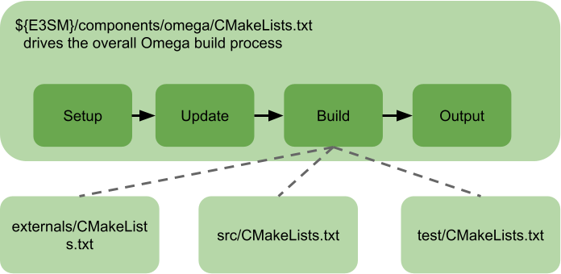

(omega-dev-cmake-build)=

# Omega Build with CMake

The Omega build system utilizes CMake, a widely-used build tool,
to facilitate the build process.

The build process is defined in the CMakeLists.txt file located
in the top-level directory of Omega. It consists of four consecutive
steps: Setup, Update, Build, and Output.



The build step consists of adding three subdirectories that drive builds
for external libraries, the Omega model, and optional tests.

Python is required to use this build system.

## Step 1: Setup

During this step, the build-controlling variables are configured.
The Omega build system supports two modes: standalone and E3SM
component. The build mode is automatically detected, and any
mode-specific differences are resolved to ensure a consistent
build process.

By default, Omega assumes it is part of the E3SM code distribution.
In both build modes, the build system collects build-controlling
parameters, such as compiler paths and flags, from the E3SM build system.

There are three types of Omega build-controlling variables: Omega,
E3SM, and CMake. The names of these variables start with "OMEGA_",
"E3SM_", and "CMAKE", respectively. Temporary variables are prefixed
with an underscore ("_").

The following is a list of Omega-specific variables available in
this version:

```
OMEGA_PROJECT_NAME: Name of the project ("OmegaOceanModel")
OMEGA_EXE_NAME: Name of the executable ("omega.exe")
OMEGA_LIB_NAME: Name of the library ("OmegaLib")
OMEGA_BUILD_MODES: List of build modes ("E3SM", "STANDALONE", "NOT_DEFINED")
OMEGA_BUILD_MODE: Selected build mode
OMEGA_DEFAULT_BUILD_TYPE: Default build type ("Release")
OMEGA_SOURCE_DIR: Directory where the top-level Omega CMakeLists.txt is located
OMEGA_INSTALL_PREFIX: User-defined output directory for the library and executable
OMEGA_ARCH: User-defined programming framework (e.g., "CUDA", "HIP", "OPENMP", "SYCL", "")
OMEGA_${YAKL_ARCH}_FLAGS: Framework-specific compiler flags
OMEGA_CXX_COMPILER: C++ compiler
OMEGA_CIME_COMPILER: E3SM compiler name defined in config_machines.xml
OMEGA_CXX_FLAGS: a list for C++ compiler flags
OMEGA_LINK_OPTIONS: a list for linker flags
OMEGA_INCLUDE_DIRECTORIES: Directory where header files are located
OMEGA_LINK_DIRECTORIES: Directory where library files are located
OMEGA_BUILD_EXECUTABLE: Enable building the Omega executable
OMEGA_BUILD_TEST: Enable building Omega tests
```

E3SM-specific variables

```
E3SM_SOURCE_DIR: E3SM component directory (${E3SM_ROOT}/components)
E3SM_CIME_ROOT: CIME root directory
E3SM_CIMECONFIG_ROOT: E3SM CIME config directory
E3SM_EXTERNALS_ROOT: E3SM externals directory
E3SM_DEFAULT_BUILD_TYPE: E3SM build type (Release or Debug)
```

CMake variables

```
CMAKE_CURRENT_SOURCE_DIR
CMAKE_CXX_STANDARD
CMAKE_CXX_COMPILER
CMAKE_CXX_FLAGS
CMAKE_CURRENT_LIST_DIR
CMAKE_BUILD_TYPE
CMAKE_INSTALL_PREFIX
CMAKE_CURRENT_BINARY_DIR
CMAKE_VERSION
```

## Step 2: Update

In this step, CMake is configured, and external library variables,
such as YAKL, MPI, NetCDF, and PNetCDF, are set based on the settings
defined in the Setup step. The integrity of the build setup is verified
at the end of this step.

## Step 3: Build

During this step, the build process is configured. It includes building
external libraries, followed by building the Omega main model from source
files. Optionally, tests can also be built.

## Step 4: Output

The final step, which is optional, involves copying a subset of the build
artifacts to designated locations or generating dynamic outputs as needed.

Note: Until the Omega build is integrated into the E3SM build, specific
modifications are required to trigger the Omega build within the E3SM
build process. Please see [Omega Build User Guide](../userGuide/OmegaBuild.md)
for details.
